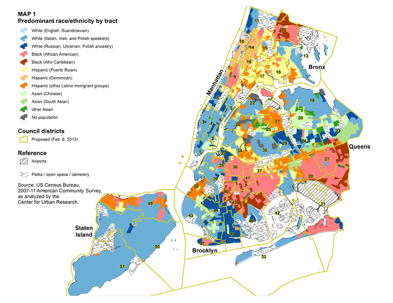

```{r setup, include=FALSE, echo=TRUE}
library(ggplot2)
library(dplyr)
knitr::opts_chunk$set(echo = TRUE, eval = TRUE, warning = FALSE)  
```
# New York City Demographics
## Introduction
**New York City ** is big and has a diverse demographic. To understand how the diversity is spread accross the city, a geographical demographic analysis has been conducted in this project and summary has been published. The map and source information has been obtained from [Center for Urban Research](https://www.gc.cuny.edu/Page-Elements/Academics-Research-Centers-Initiatives/Centers-and-Institutes/Center-for-Urban-Research/CUR-research-initiatives/Communities-of-Interest-in-New-York-City).

```{r pic, echo=FALSE}  

```
```{r setup1, echo=FALSE, include=TRUE,message=FALSE}
library(Lahman)
library(tidyverse)
library(dplyr)
library(readr)
library(haven)
library(readxl)
library(DT)
```
## Data

To analyze the how the demograpic is spread accross the zip codes in New York City, I obtained XML files from City of New York Government website [Catalog data](https://catalog.data.gov/dataset/demographic-statistics-by-zip-code-acfc9)

## Process and Packages

The XML file was read into R using XML package. Though there are other packages such as XML2, I chose the standard and easy to use functions from  XML package because XML2 is newly developed wrapper around the comprehensive libxml2 C library that makes it easier to work with XML and HTML in R. For my standard XML source downladed from New York City Govt website, XML package have reasonable parsing funtions. 

Using the function _xmlParse_, I read source XML file into XML Class. Then I extracted the node level information by identifying the node using getNodeSet function that takes the path information as an argument. I then converted the result node level info into a data frame using xmlToDataFrame function. The result is 46 variable data frame. 
Based on the percentage demographic, three categorical variables have been developed and added to the data frame whcih were later converted to factors. The rest of the analysis and graphs are based on the caculated categorical variables. 

### XML source
```{r read0, echo=TRUE, include=TRUE,message=FALSE}
require(XML)
require(methods)
# Parse the XML file and prepare a data frame from second node leaving the headers
result <- xmlParse("rows.xml")
raw_df <- xmlToDataFrame(node=getNodeSet(result,"//response/row/row"))
# Coverting full data frame of factors into numeric variables
raw_df2 <- mutate_if(raw_df, is.factor, ~ as.numeric(levels(.x))[.x])
# Changing the Jurisdiction variable into characher
raw_df2$jurisdiction_name <- as.character(raw_df2$jurisdiction_name)
#By end of this code chunk. we have completed the preparing the base data frame in raw_df2
```

### Demographic summary by the Zip code (Jurisdiction)

```{r read1, echo=TRUE, include=TRUE,message=FALSE}
# Addtional Categorical Variables being added based on percentahe demographic variables
# Setting the Predominanct demographic variable Main_Demo if any demograhic is > 50%, if none is >50% set to Mixed
demo_df <- mutate(raw_df2,
Main_Demograph = ifelse(percent_white_non_hispanic > 0.5, "White",
            ifelse(percent_black_non_hispanic > 0.5, "Black",
            ifelse(percent_asian_non_hispanic > 0.5, "Asian",
            ifelse(percent_pacific_islander   > 0.5, "Pacific Islander",
            ifelse(percent_hispanic_latino    > 0.5, "Hispanic",
            ifelse(percent_american_indian    > 0.5, "American Indian",
            ifelse(percent_ethnicity_unknown  > 0.5, "Unknown",
                                                     "Mixed" ))))))),
Citizenship   = ifelse(percent_us_citizen         > 0.5, "US Citizen",
            ifelse(percent_permanent_resident_alien > 0.5, "Permanent Resident",
            ifelse(percent_other_citizen_status > 0.5, "Other Citizen",
            ifelse(percent_citizen_status_unknown > 0.5, "Unknown",      
                                                       "Mixed")))),
Public_Assistance = ifelse(percent_receives_public_assistance > 0.33, "More than one thrid receive","No/Not much"))
# Set Categorical variables as factors
demo_df$Main_Demograph <- as.factor(demo_df$Main_Demograph)
demo_df$Citizenship <- as.factor(demo_df$Citizenship)
demo_df$Public_Assistance <- factor(demo_df$Public_Assistance)
#Order the factor variables
demo_df$Main_Demograph<- ordered(demo_df$Main_Demograph, levels = c("White", "Black", "Asian", "Pacific Islander","Hispanic","American Indian", "Unknown", "Mixed"))
demo_df$Citizenship <- ordered(demo_df$Citizenship, levels = c("US Citizen", "Permanent Resident", "Other Citizen", "Unknown", "Mixed"))
demo_df$Public_Assistance <- ordered(demo_df$Public_Assistance, levels = c("More than one thrid receive", "No/Not much"))
select (demo_df,jurisdiction_name, Main_Demograph, Citizenship, Public_Assistance) %>% DT::datatable(demo_df,rownames=FALSE)
```

## Numeric Summaries
We will consider three categorical variables from the data set: main demographic, their citizenship status , and whether or not they receive public assistance from the Government.

### Full table
This two way table shows the count of the Jurisdictions by their demographic and citizenship.  

```{r read2, echo=TRUE, include=TRUE,message=FALSE}
library(tables)
table(demo_df$Main_Demograph,demo_df$Citizenship) %>% knitr::kable(caption="Demographic and Citizenship information")
```

### Tables by Govt. Public Assistance Indicator
Below are three way tables show the count of the Jurisdictions by their demographic with a breakup by whether they recive Goverment Public assistance.

```{r read3, echo=TRUE, include=TRUE,message=FALSE}
tab <- table(demo_df$Main_Demograph,demo_df$Citizenship, demo_df$Public_Assistance)
```

```{r read4, echo=TRUE, include=TRUE,message=FALSE}
tab[,,1] %>% knitr::kable(caption="Count of Jurisdictions that have more than one third population receive Government Public Assistance:")
```

```{r read5, echo=TRUE, include=TRUE,message=FALSE}
tab[,,2] %>% knitr::kable(caption="Count of Jurisdictions that does not need much Government Public Assistance:")
```

## Visuals
### One Variable

Below two bar charts are one variable charts. The first bar chart below indicates the count of the jurisdictions by their predominant demographic (more than 50% population). The second bar chart shows the count of jurisdictionss by their Citizenship status.

```{r read6, echo=TRUE, include=TRUE,message=FALSE}
a <- ggplot(demo_df, aes(x=demo_df$Main_Demograph))
a + geom_bar()+labs(x = "Pedominant Demograhic (More than 50% Population)") 
b <- ggplot(demo_df, aes(x=demo_df$Citizenship))
b + geom_bar()+labs(x = "Pedominant Citizenship (More than 50% Population)") 
c <- ggplot(demo_df, aes(x=demo_df$Public_Assistance))
c + geom_bar()+labs(x = "Govt Public Assistance") 
```

### Two Variables
Below three bar charts are two variable charts. The first bar chart indicates the count of the jurisdictions  by their demographic with each colored bar indicating the whether more than one of the demograpic receice Goverment public assistance or not. The second bar chart shows the the count of jurisdictions by their citizenship status  with each colored bar indicating whether more than one of the demograpic receice Goverment public assistance or not. The third bar chart shows the count of the jurisdictions by citizenship status with each colored bar indicating the predominant demographic.

```{r read7, echo=TRUE, include=TRUE,message=FALSE}
d <- ggplot(demo_df, aes(x=demo_df$Main_Demograph))
d + geom_bar(aes(fill = as.factor(Public_Assistance)), position = "dodge")+labs(x = "Prodominant Demographic",fill ="")
e <- ggplot(demo_df, aes(x=demo_df$Citizenship))
e + geom_bar(aes(fill = as.factor(Public_Assistance)), position = "dodge")+labs(x = "Citizenship Status",fill ="")
e <- ggplot(demo_df, aes(x=demo_df$Citizenship))
e + geom_bar(aes(fill = as.factor(Main_Demograph)), position = "dodge")+labs(x = "Citizenship Status",fill ="Main Demograhic")
```

### Three Variables
Below bar charts is a three variable chart that indicates count of jurisdictions by their main demographic with each colored bar indicating whether more than one of the demograpic receice Goverment public assistance or not. This chart is then grouped by the third variable, the Citizenship status.

```{r read8, echo=TRUE, include=TRUE,message=FALSE}
f <- ggplot(demo_df, aes(x=demo_df$Main_Demograph))
f + geom_bar(aes(fill = as.factor(Public_Assistance)), position = "dodge")+labs(x = "Main Demographic",fill ="")+facet_wrap(demo_df$Citizenship)
```

## Conclusion
The Numerical summaries and visuals show the demographic, citizenship information by the jurisidiction and visual representation of where the Government provided public assistance is used. This is information can used by Govt and Social workers to focus on community training and funding to the areas that need the most.